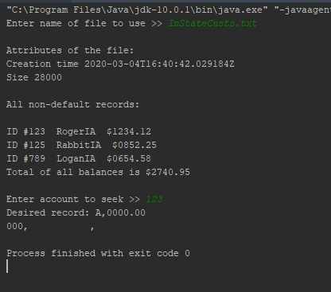
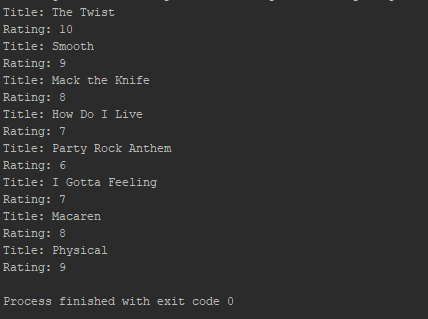

# Chapter 13
<li>PURPOSE OF PROJECT: Chapter 13                   </li>
<li>VERSION or DATE: 3/5/20                          </li>
<li>HOW TO START THIS PROJECT:                       </li>
<li>AUTHORS: Logan Gosch                             </li>
<li>USER INSTRUCTIONS: Do what you're asked.         </li>

The reader class uses buffers and arrays to read from and display the text from the files. This is done using buffers to
differeniate the characters and new lines. Using the specific finder also uses buffer and assigns it to a integer that the user enters. The program reads as a the entire file and that's why the buffer is used.

The writer class is very similar as in it uses buffers, but different because it writes by using string builder to use multiple 
inputs. More than one parameters makes the method use a delimiter to identify the different elements. Writing to a file is essential to the scope of programming

Try and Catch are used when accessing files. Try is used to edit and read while catch is to throw back any potential errors.

# PLTW 1.2.1

<li>PURPOSE OF PROJECT: 1.2.1                   </li>
<li>VERSION or DATE: 3/9/20                          </li>
<li>HOW TO START THIS PROJECT:                       </li>
<li>AUTHORS: Logan Gosch                             </li>
<li>USER INSTRUCTIONS: Do what you're asked.         </li>

#3: The methods used are readString() and writeString(). The former involves taking a file path and displaying it
and throwing an error if it doesn't exist. The latter entails taking a string or multiple strings and writing them to a file.

#29: The for loop is better knowing the limit, and the while loop is better if you don't know or want a limit.

#Conclusion 1: One scenario where a for loop would be preferred is if you wanted to make a program to track and limit sales or inventory to a certain amount each day or so. A while loop would look something like a program design to keep a system going unless another fails.

#Conclusion 2: The changes in hardware was the uprising of mobile. This caused the new android to adapt to the new low power vendetta.

